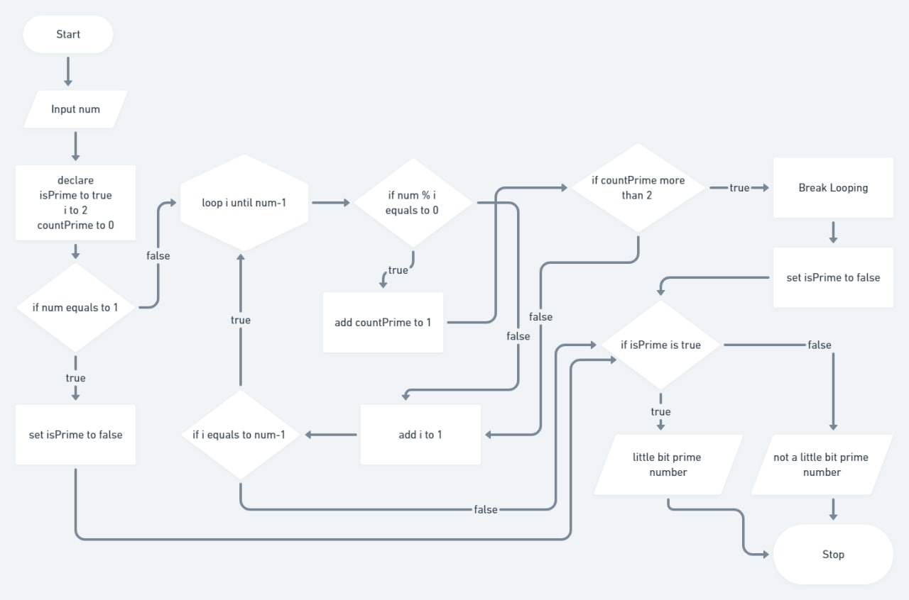

# Day 2

## Introduce to Algorithm

Algoritma adalah suatu proses atau tahap2 untuk menyelesaikan persoalan yang terdiri dari input ( masukan ) , proses , dan output ( hasil )

Sarana yang di gunakan untuk menggambarkan Algoritma yaitu 
- Flow Chart
- Pseudo code 

### Task 01 - Introduction to Algorithm 

#### Jawaban Problem 1 - Bilangan Agak Prima 

